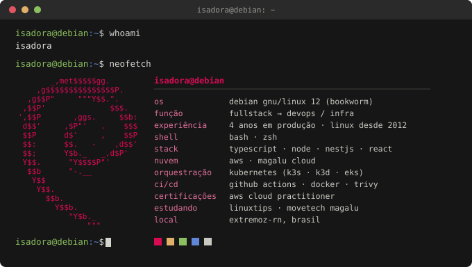

Gosto de entender todo o sistema, não só a parte que me cabe, pois quando
ele quebra eu quero entender por quê, e não apenas como contornar.

Esse painel abaixo faz parte disso. Foi construído com ajuda de IA e
mostra as vulnerabilidades dos repositórios do meu namespace. Você pode
usar no seu GitHub também.

Ele mede uma foto do estado atual. A partir daqui, o trabalho é fazer o
número descer, e a série temporal registra se está descendo mesmo.

**[security-dashboard](https://github.com/ISXDora/security-dashboard)** —
o código que gera esse painel. Roda no GitHub Actions e não depende de
serviço externo.

---

[LinkedIn](https://www.linkedin.com/in/isadoraxavier) · Extremoz-RN, Brasil
